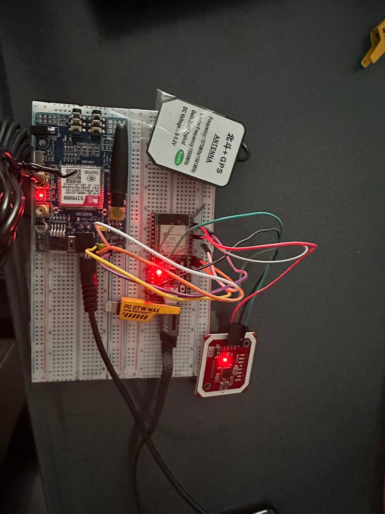

*Part of the Tamdan-Kon school bus tracking system — see other related repo from [full project overview](https://github.com/Konnarak1234/tamdan-kon)*

## Purpose of the repo
This repo is for storing the source code of the integrated IoT devices that use in Tamdan-Kon system.
1. **np532_card_scan_code.c** : source code for esp32 + np532, for a device to read student card id and forward the information to specific api end-point through wifi connection.  
2. **sim808_gps_code.c** : source code for esp32 + sim808 + gps antenna, for a device to lock and track the geocoding from the satellite navigation system and forward the information to specific api end-point through wifi connection.

## Specific Role in System
**Tamdan-Kon firmware** is alternative way for school bus location-collecting, beside the location that could be collect from driver mobile phone. Moreover, it have a capability to read student id card, to inform the system about student boarding confirmation.

## Tech-Stack
**Arduino IDE**: text-editor and enviromental for implementing software for micro-controller board, in our case esp32 -- for communication with each specific IoT device such as sim808 and np532.

**Important Library Used**: wifi and http library, are the main library for sending information gather by IoT devices to tamdan-Kon system through it api end-point.

**sim808 + gps antenna**: collect bus location information in term of geocoding.

**np532** : using near field communication technology for reading student id card.

## PIN Out
**PN532 with ESP32:**
| PN532  | ESP32  |
|-----------|-----------|
| **SDA**       | **GPIO 21**   |
| **SCL**       | **GPIO 22**   |
| **VCC**      | **5V**      |
| **GND**       | **GND**      |

**Sim808 with ESP32:**
| ESP32              | SIM808 | Purpose          |
| ---------------------- | ---------- | ---------------- |
| **GPIO17 (TX2)**       | **RXD**    | ESP32 → SIM808   |
| **GPIO16 (RX2)**       | **TXD**    | SIM808 → ESP32   |
| **GND**                | **GND**    | Common ground    |

## Overviews of Tamdan-Kon Firmware
